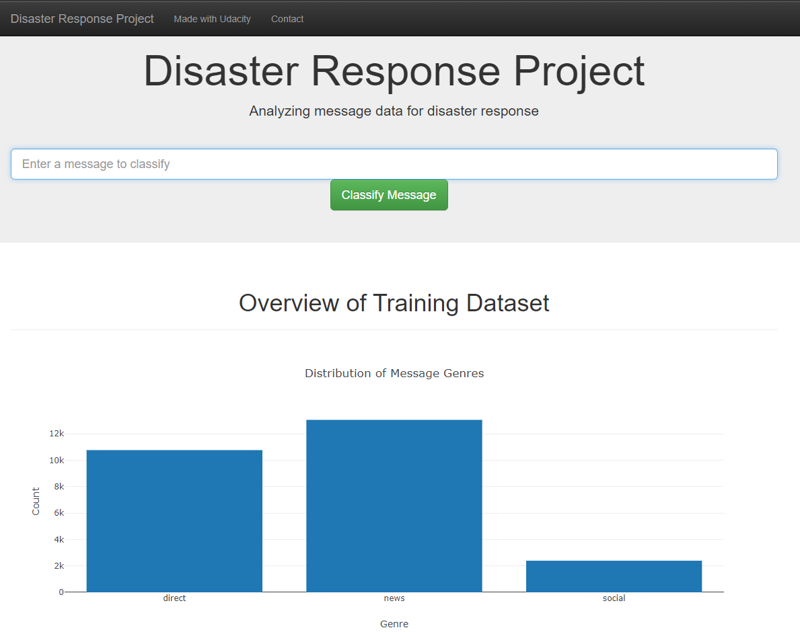
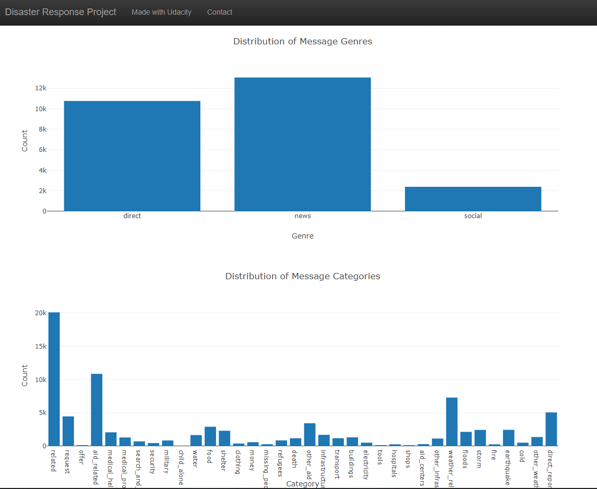
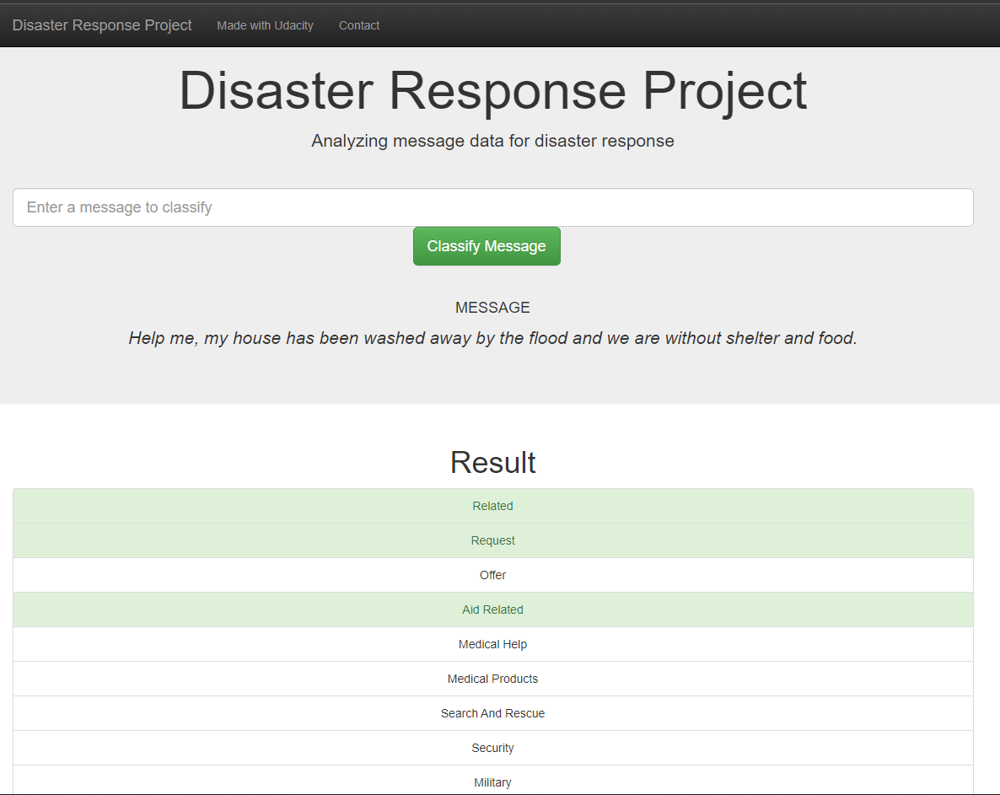
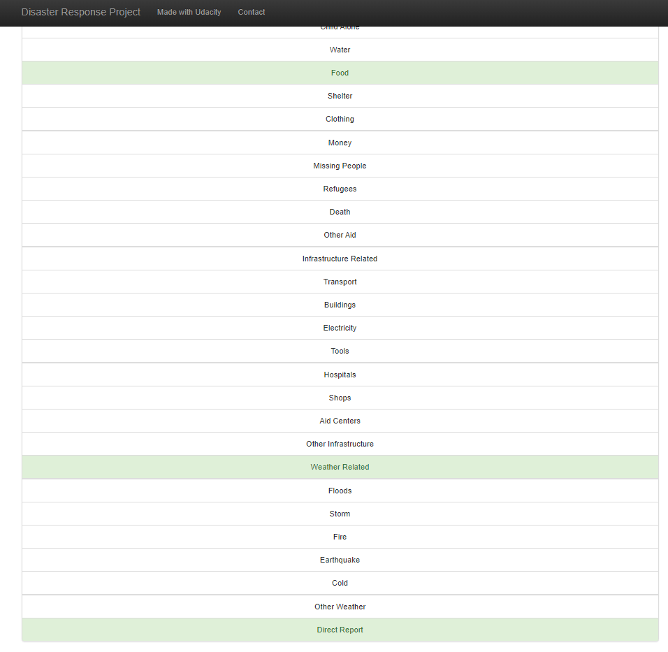

# Disaster Response Pipeline Project

## Description
In this project, I applied my data engineering skills to analyze disaster data from [Figure Eight](https://appen.com/) to build a machine learning model for an API that classifies disaster messages. I have created a machine learning pipeline to categorize real messages that were sent during disaster events so that the messages could be sent to an appropriate disaster relief agency. The project includes a web app where an emergency worker can input a new message and get classification results in several categories. The web app will also display visualizations of the data.

## Pipeline
There were three stages for the construction of the project.

### 1 - ETL Pipeline

A Python script, [process_data.py](data/process_data.py), writes a data cleaning pipeline that:

 - Loads the messages and categories datasets
 - Merges the two datasets
 - Cleans the data
 - Stores it in a SQLite database
 
 A jupyter notebook [ETL Pipeline Preparation](jupyters/ETL_Pipeline_Preparation.ipynb) was used to do EDA to prepare the [process_data.py](data/process_data.py) python script.

 ### 2 - ML Pipeline
A Python script, [train_classifier.py](models/train_classifier.py), writes a machine learning pipeline that:
 - Loads data from the SQLite database
 - Splits the dataset into training and test sets
 - Builds a text processing and machine learning pipeline
 - Trains and tunes a model using GridSearchCV
 - Outputs results on the test set
 - Exports the final model as a pickle file

 A jupyter notebook [ML Pipeline Preparation](jupyters/ML_Pipeline_Preparation.ipynb) was used to do EDA to prepare the [train_classifier.py](models/train_classifier.py) python script.

 ### 3 - Flask Web App
 The project includes a web app where an emergency worker can input a new message and get classification results in several categories. The web app will also display visualizations of the data. The outputs are shown below:

#### Frontend

#### Prediction

 
## Running code scripts and starting the app

1 - Run the following commands in the project's root directory to set up your database and model.

* To run ETL pipeline that cleans data and stores in database `python data/process_data.py data/disaster_messages.csv data/disaster_categories.csv data/DisasterResponse.db`
* To run ML pipeline that trains classifier and saves `models/train_classifier.py data/DisasterResponse.db models/classifier.pkl`

2 - Run the following command in the app's directory to run your web app. `python app/run.py`

3 - Access in your browser http://0.0.0.0:3001/